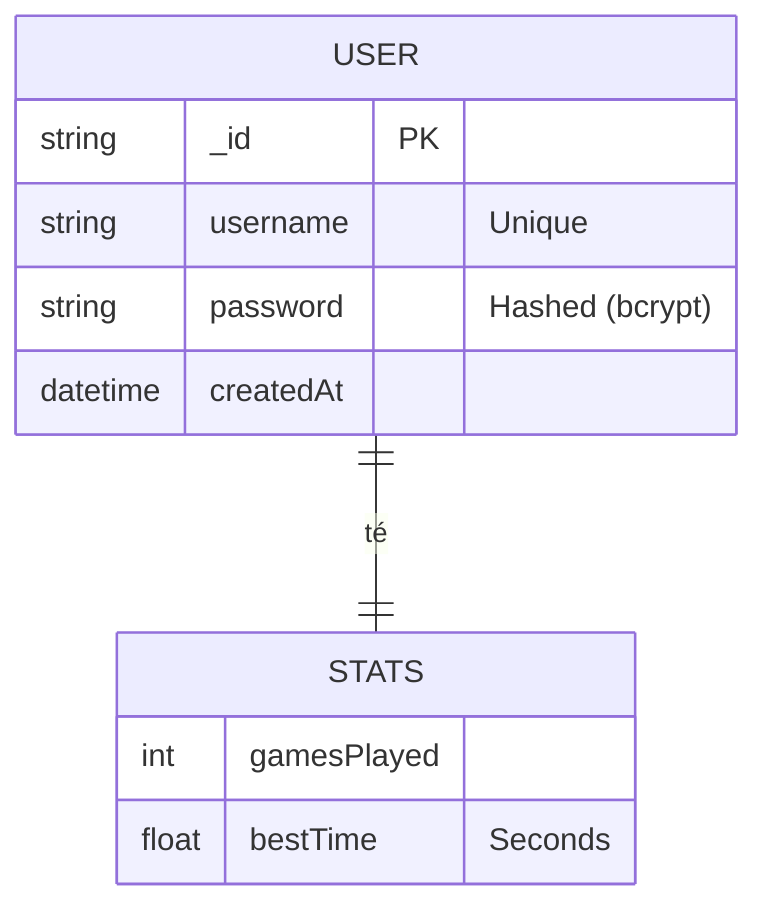
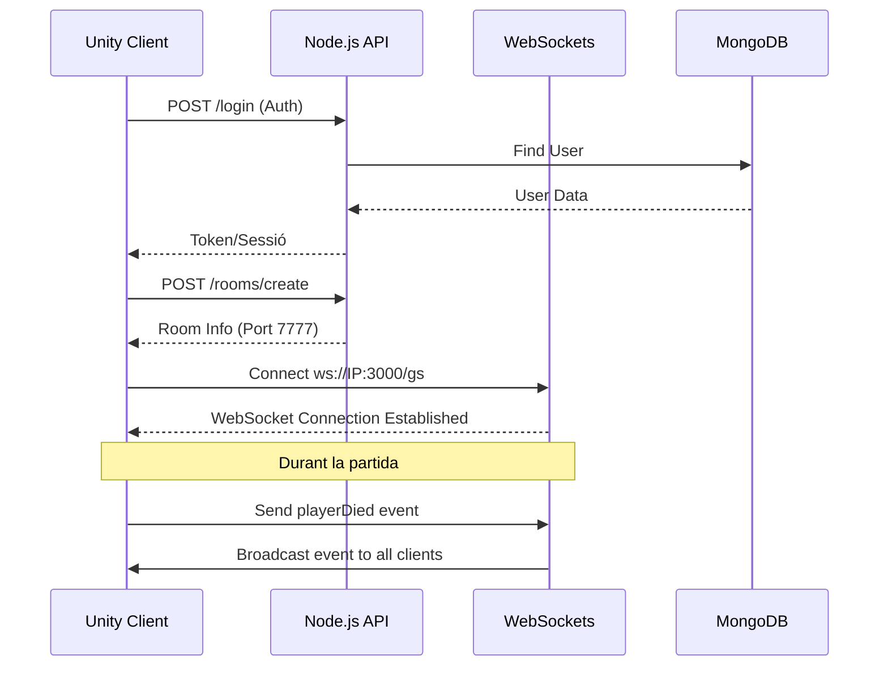

# Documentació Tècnica: El Último Samurai

## 📊 Diagrama Entitat-Relació (E/R)
Com que fem servir **MongoDB** (NoSQL), l'esquema és documental. Aquesta és la representació de la col·lecció d'usuaris:

## 🏗️ Diagrama d'Arquitectura (Flux de dades)
Representació de com interactuen els diferents components del sistema:

## 🛠️ Tecnologies Utilitzades
- **Motor:** Unity 2022.3 LTS
- **Networking:** Netcode for GameObjects (NGO)
- **Backend:** Node.js + Express
- **Base de Dades:** MongoDB 7.0
- **Servidor:** VPS Linux (Ubuntu 24.04)
- **Proxy:** Nginx
- **Control de Processos:** PM2
